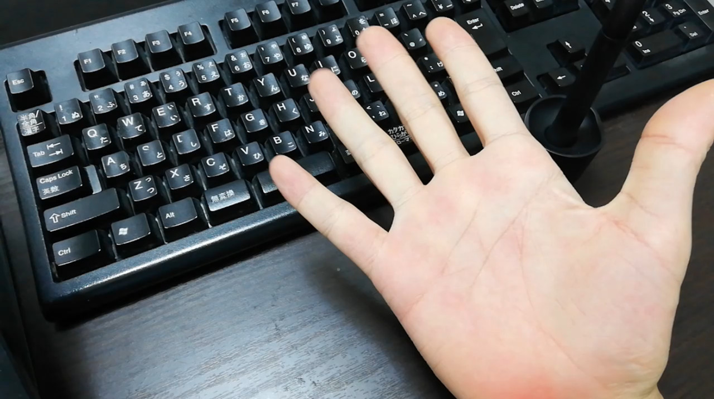
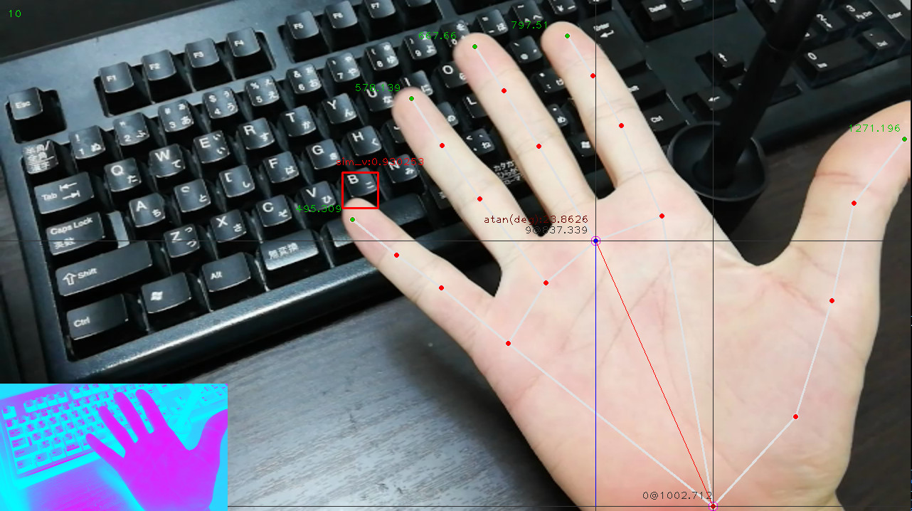

### computer vision practice  
  
---

Real-time keyboard B key and hand recognition  
Input from the computer's camera.  
  
| input | output |
| ----- | ------ |
|  |  |
  
When using the OBS virtual camera, you need to add a plug-in manually instead of the one that comes with it. (Because the camera cannot be recognized from Python)  
